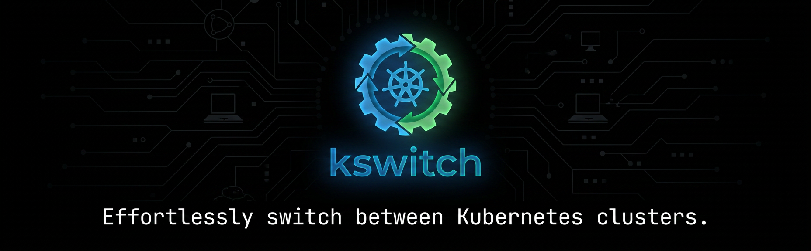

<p align="center">
  
</p>

# kswitch


[](https://github.com/MichaelSp/kswitch/actions?query=workflow%3A"Build")
[](https://goreportcard.com/badge/github.com/MichaelSp/kswitch)
[](https://opensource.org/licenses/Apache-2.0)

**The kubectx for operators.** Fuzzy search across 14+ cloud providers, per-terminal context isolation, history navigation, and extensible hooks — built for large-scale Kubernetes.

## Highlights

- **Unified fuzzy search** — one search over EKS, AKS, GKE, Gardener, Vault, filesystem, and more
- **Terminal isolation** — each window targets a different cluster; the original kubeconfig is never modified
- **History** — every `{context, namespace}` tuple recorded; jump back with `switch .` or `switch -`
- **Context aliases** — human-friendly names for cryptic generated context names
- **Search index cache** — instant results across massive directories or slow remote stores
- **Hooks** — run arbitrary executables before search to sync, refresh, or rotate credentials
- **Drop-in replacement** for `kubectx` — set `alias kubectx=switch` and keep your workflow

## Demo

<p align="center">
  
  
</p>

## Install

### macOS

```sh
brew install kswitch
echo 'source <(kswitch init zsh)' >> ~/.zshrc
source ~/.zshrc
```

### Linux

```sh
curl -L -o /usr/local/bin/kswitch \
  https://github.com/MichaelSp/kswitch/releases/latest/download/kswitch_linux_amd64
chmod +x /usr/local/bin/kswitch
echo 'source <(kswitch init bash)' >> ~/.bashrc && source ~/.bashrc
```

### Windows

Download the binary from the [releases page](https://github.com/MichaelSp/kswitch/releases/latest), place it in your `PATH`, then:

```powershell
kswitch init powershell >> $PROFILE
. $PROFILE
```

Then type `switch` (bash/zsh) or `kswitch` (fish/PowerShell) to start.

## Documentation

Full documentation is available at **[MichaelSp.github.io/kswitch](https://MichaelSp.github.io/kswitch)**:

- [Installation guide](https://MichaelSp.github.io/kswitch/installation/) — shell completion, all platforms
- [Kubeconfig stores](https://MichaelSp.github.io/kswitch/kubeconfig_stores/) — multi-provider setup
- [Search index](https://MichaelSp.github.io/kswitch/search_index/) — caching for large setups
- [Hooks](https://MichaelSp.github.io/kswitch/hooks/) — extensibility
- [Cloud provider guides](https://MichaelSp.github.io/kswitch/stores/eks/eks/) — EKS, AKS, GKE, Gardener, Vault, and more
